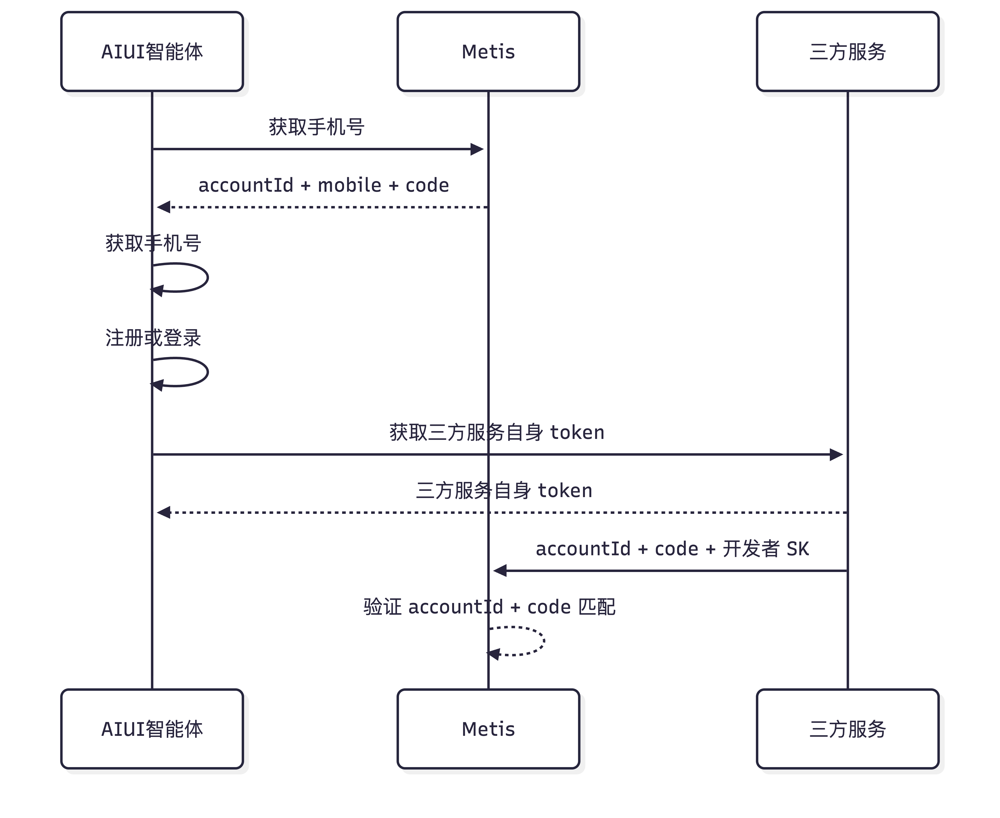
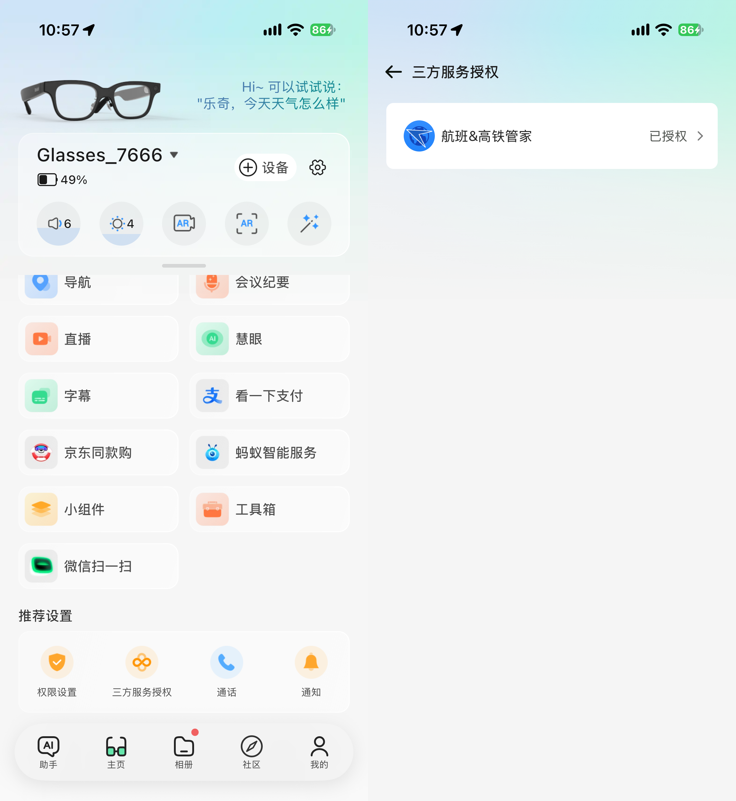
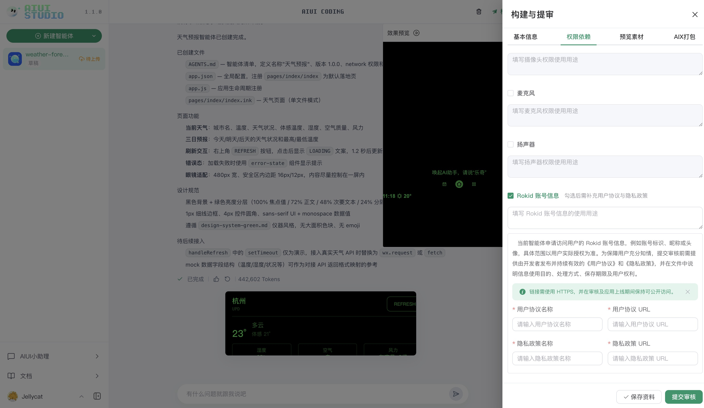
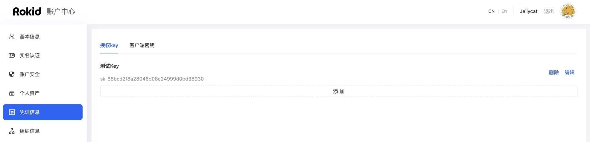

# Rokid 账号信息授权
AIUI 智能体可以读取当前 Rokid 账号的基础信息，并通过一次性校验码将用户身份传递给开发者服务端。代码调用前必须完成开发者权限声明和用户授权，否则手机号、账号校验码等受限字段可能为空或不可用。


## 1. 授权与调用流程
```latex
开发者在 AIUI Studio 勾选“Rokid 账号信息”权限
                     ↓
开发者填写使用用途、用户协议和隐私政策，并保存资料
                     ↓
用户在 Rokid AI App 的“三方服务授权”中完成授权
                     ↓
智能体调用 checkUserAuth() 检查授权状态
                     ↓
智能体调用 getProfile() 获取账号基础信息和一次性校验码
                     ↓
开发者服务端按需调用 checkAccountCode 校验账号与智能体归属
```


> **授权链路缺一不可**
+ 开发者需要在 AIUI Studio 中勾选“Rokid 账号信息”权限并保存资料
+ 用户需要在 Rokid AI App 的“三方服务授权”中完成授权

| 角色 | 操作 | 结果 |
| --- | --- | --- |
| 开发者 | 在 AIUI Studio 声明“Rokid 账号信息”权限 | 平台了解智能体为何需要账号信息 |
| 用户 | 在 Rokid AI App 完成三方服务授权 | 允许该开发者的智能体读取受限账号字段 |
| 智能体 | 检查授权状态并获取账号信息 | 获得可用的账号字段及授权提示 |
| 开发者服务端 | 按需校验 `accountId` 和 `code` | 确认用户身份及智能体归属 |


## 2. 开发者配置权限依赖
1. 在 AIUI Studio 中打开需要读取账号信息的智能体。
2. 进入右侧“构建与提审”，选择“权限依赖”。
3. 勾选“Rokid 账号信息”，填写具体使用用途。
4. 补充用户协议与隐私政策，并保存资料。
5. 已构建的智能体需要生成并部署新版本，确保新的权限配置生效。



权限用途应与代码行为一致，只申请业务必需的信息。未勾选权限、未保存资料或隐私材料不完整时，用户授权链路可能无法正常建立。

## 3. 用户完成三方服务授权
1. 用户使用与眼镜一致的 Rokid 账号登录 Rokid AI App。
2. 在“主页”的“推荐设置”区域点击“三方服务授权”。
3. 进入授权页面后，找到对应开发者或服务，勾选需要授权的权限，阅读授权说明并确认授权。
4. 返回智能体，重新触发需要账号信息的功能。



用户未授权、撤销授权或授权关系失效时，智能体仍可能获得部分非敏感信息，但 `mobile`、`code` 等受限字段可能为空。此时应根据 `notification` 引导用户完成授权（当`notification`不为空时）。

## 4. 智能体检查授权并获取账号信息
### 4.1 检查用户授权状态
调用 `checkUserAuth()` 可以检查当前用户是否已完成授权。检查结果用于日志、页面提示和问题排查，不应作为后续接口调用的硬性门禁；即使检查失败，也可以继续调用 `getProfile()` 获取当前可用的非敏感字段。

```typescript
import { createOpenAPI } from 'open';

const api = await createOpenAPI();
const authResult = await api.auth.checkUserAuth();

if (!authResult?.data?.checkResult) {
  console.warn(authResult?.data?.msg || '用户尚未完成账号授权');
}
```

未授权时的响应示例：

```json
{
  "code": 1,
  "msg": "success",
  "timestamp": 1762760038068,
  "uuid": "trace-id",
  "data": {
    "checkResult": false,
    "msg": "用户未与开发者签约"
  }
}
```

### 4.2 获取用户账号基础信息
获取当前登录用户的账号基础信息，并生成一个有效期为 5 分钟的账号校验码。

#### 请求方式
+ 在 AIUI 智能体代码中调用：

```typescript
import { createOpenAPI } from 'open';

const api = await createOpenAPI();
const profile = await api.account.getProfile();
```

#### 响应参数
该接口直接返回账号信息对象。

| 参数 | 类型 | 说明 |
| --- | --- | --- |
| `accountId` | `string` | 当前用户的账户 ID |
| `headIcon` | `string` | 用户头像地址；未设置头像时可能为空 |
| `userName` | `string` | 用户昵称 |
| `mobile` | `string` | 用户手机号码；未授权或未绑定手机号时可能为空 |
| `code` | `string` | 一次性账号校验码，有效期 5 分钟；未授权时可能为空 |
| `notification` | `string` | 需要向用户展示的授权提示；无需提示时可能为空 |


#### 成功响应示例
```json
{
  "accountId": "123456789",
  "headIcon": "https://example.com/avatar.png",
  "userName": "张三",
  "mobile": "138****8888",
  "code": "6d9b691ec18a4690bd43cf53df4d49d2",
  "notification": null
}
```

#### 未授权提示示例
当智能体要求用户授权，但当前用户尚未完成授权时，`notification` 会返回提示信息：

```json
{
  "accountId": "123456789",
  "headIcon": "https://example.com/avatar.png",
  "userName": "张三",
  "mobile": null,
  "code": null,
  "notification": "若需要使用当前功能，请前往Rokid AI APP-主页-三方服务授权进行账号授权"
}
```

收到非空的 `notification` 时，应向用户展示或转述提示，不要继续假设受限字段一定存在。

#### 注意事项
1. 每次请求都会生成新的账号校验码。
2. 账号校验码有效期为 5 分钟。
3. 校验码与当前账号及对应的智能体绑定。
4. 如果开发者服务端需要确认用户身份，应将返回的 `accountId` 和 `code` 提交给账号校验接口。

---

## 5. 开发者服务端校验账号校验码
当开发者服务端需要建立可信账号会话时，调用此接口检查账号校验码是否有效，并验证生成校验码的智能体是否属于指定开发者。只在智能体界面展示账号基础信息时，可以不执行此步骤。

> `developerSk` 是开发者凭证，只能保存在服务端，不能写入 AIUI 智能体代码、客户端包或前端日志。
> 
> 该SK从Rokid 账号中心-凭证信息处新增获取





### 请求信息
+ **接口路径**：`https://rcs.rokid.com/metis/openApi/v1/checkAccountCode`
+ **请求方式**：`POST`
+ **Content-Type**：`application/json`

> 如果直接访问 Metis 服务而不经过网关，请求路径为 `/openApi/v1/checkAccountCode`
>

### 请求头
除 `Content-Type: application/json` 外，无需其他业务请求头。

### 请求体
| 参数 | 类型 | 必填 | 说明 |
| --- | --- | --- | --- |
| `accountId` | String | 是 | `/profile` 接口返回的账户 ID |
| `code` | String | 是 | `/profile` 接口返回的账号校验码 |
| `developerSk` | String | 是 | 开发者 SK，用于验证智能体所属开发者；从开发者账号中心的凭证信息中获取 |


### 请求示例
```bash
curl --location --request POST 'https://rcs.rokid.com/metis/openApi/v1/checkAccountCode' \Collapse commentComment on line R174yorkie commented on Sep 7, 2026 yorkieon Sep 7, 2026MemberMore actions服务端接口如果有更新，需要同步更新 skill 和包，而不仅仅更新文档。ReactWrite a replyResolve comment
  --header 'Content-Type: application/json' \
  --data-raw '{
    "accountId": "123456789",
    "code": "6d9b691ec18a4690bd43cf53df4d49d2",
    "developerSk": "developer-sk"
  }'
```

### 响应参数
#### 通用响应结构
| 参数 | 类型 | 说明 |
| --- | --- | --- |
| `code` | Integer | 业务状态码，`1` 表示接口调用成功 |
| `msg` | String | 响应信息 |
| `timestamp` | Long | 响应时间戳，单位为毫秒 |
| `uuid` | String | 请求链路追踪 ID |
| `data` | Object | 校验结果 |


#### `data` 参数
| 参数 | 类型 | 说明 |
| --- | --- | --- |
| `checkResult` | Boolean | `true` 表示校验通过，`false` 表示校验失败 |
| `mobile` | String | 校验通过后返回的用户手机号码 |


### 校验成功响应
```json
{
  "code": 1,
  "msg": "success",
  "timestamp": 1787760000000,
  "uuid": "trace-id",
  "data": {
    "checkResult": true,
    "mobile":"13888888888"
  }
}
```

### 校验失败响应
```json
{
  "code": 1,
  "msg": "success",
  "timestamp": 1787760000000,
  "uuid": "trace-id",
  "data": {
    "checkResult": false
  }
}
```

### 校验失败条件
以下任一情况都会返回 `checkResult = false`：

1. `accountId`、`code` 或 `developerSk` 为空。
2. 账号校验码不存在或已超过 5 分钟有效期。
3. 校验码对应的智能体不存在或已删除。
4. `developerSk` 无效。
5. `developerSk` 对应的开发者不是该智能体的创建者。
6. 调用账号中心验证开发者 SK 时发生异常。

### 注意事项
1. 账号校验码校验成功后会被立即删除，不能重复使用。
2. 校验失败时，校验码不会主动删除；未超过有效期时可以再次提交正确的 `developerSk`。
3. `checkResult = false` 属于业务校验失败，接口响应的通用 `code` 仍然为 `1`。
4. 建议在获取 `getProfile()` 返回结果后，于 5 分钟内完成校验。

## 6. 常见问题排查
| 现象 | 可能原因 | 处理方式 |
| --- | --- | --- |
| `checkUserAuth()` 返回 `false` | AIUI Studio 未声明权限，或用户尚未授权 | 先检查“Rokid 账号信息”权限是否已保存，再引导用户前往 Rokid AI App 授权 |
| `notification` 返回授权提示 | 用户授权未完成、被撤销或已失效 | 向用户展示提示，完成授权后重新调用接口 |
| `mobile` 或 `code` 为空 | 用户未授权、未绑定手机号，或权限配置尚未生效 | 对字段进行空值判断，并逐项检查开发者配置和用户授权 |
| 返回“用户票据失效” | Rokid 账号登录态已失效 | 引导用户重新登录 Rokid AI App 或重新进入智能体 |
| `checkResult = false` | 校验码过期、`developerSk` 错误或智能体归属不匹配 | 获取新的校验码，并核对服务端使用的开发者 SK |
| 校验码无法重复使用 | 校验码已成功校验并被删除 | 重新调用 `getProfile()` 获取新的校验码 |


## 7. 数据与凭证安全
+ 仅申请和处理业务必需的账号信息，并在用户协议和隐私政策中准确说明用途。
+ `developerSk` 只能保存在开发者服务端的环境变量或密钥管理服务中。
+ 账号校验码有效期为 5 分钟且成功后立即失效，不应缓存或重复使用。
+ 不要在日志中记录完整手机号、账号校验码、开发者 SK 或其他敏感信息。
+ 对 `mobile`、`code` 和 `notification` 等字段始终进行空值检查，避免将未授权状态误判为接口故障。
